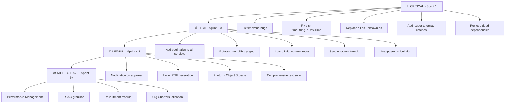

# 🔬 WIG HRIS — Deep System Audit Report

> **Audit Date:** 9 Juni 2026 | **Build Status:** ✅ Production build clean (98 routes)
> **Stack:** Next.js 16.1.6 + Prisma (MySQL) + PWA + face-api.js

---

## Ringkasan Eksekutif

| Kategori | Count |
|---|---|
| 🔴 Bug / Error Kritis | 7 |
| 🟡 Fitur Belum Sempurna | 11 |
| 🔵 Optimisasi | 14 |
| 🟢 Fitur HRIS yang Harus Dikembangkan | 15 |

---

## 1. 🟡 Fitur Belum Selesai / Belum Sempurna

### 1.1 ❌ Test Coverage Sangat Rendah
**Severity: HIGH**

Hanya ada **4 file test** di `tests/api/` dan **2 file test** di `src/lib/services/__tests__/`:
- `auth.test.ts` (2.3 KB)
- `master.test.ts` (2.4 KB)  
- `attendance.test.ts` (641 bytes — sangat minimal)
- `assets.test.ts` (1.4 KB)
- `overtimeCalcService.test.ts` (6 KB)
- `pph21Service.test.ts` (4.7 KB)

> [!CAUTION]
> Modul krusial **tanpa test sama sekali**: `leaveService` (balance recalculation), `bpjsService`, `bulkImportService`, `payslipService`, `attendanceCorrectionService`, `visitService`. Ini adalah area paling rawan bug karena melibatkan kalkulasi finansial dan logika approval atomik.

### 1.2 ❌ Audit Trail Tidak Konsisten
**File:** [auditService.ts](file:///c:/Users/IT%20WIG/Desktop/absensi/src/lib/services/auditService.ts)

- `auditService.logAction()` menggunakan `any` untuk parameter `details` (L8) — melanggar konvensi type-safety.
- Menggunakan `console.error` (L22) bukan `logger.error` — melanggar [CONVENTIONS.md L103](file:///c:/Users/IT%20WIG/Desktop/absensi/CONVENTIONS.md#L103).
- **Tidak semua operasi destructive di-audit.** Audit log hanya terintegrasi di beberapa API route, bukan semua. Operasi `DELETE` pada employee, shift, dan news kemungkinan tidak ter-log.

### 1.3 ❌ Payroll Belum Terintegrasi Penuh
**File:** [payroll/page.tsx](file:///c:/Users/IT%20WIG/Desktop/absensi/src/app/dashboard/payroll/page.tsx) (50.1 KB — file terbesar!)

- Payroll page monolitik (50 KB = ~1400+ baris) — seharusnya dipecah per konvensi ≤100 baris.
- **Tidak ada integrasi otomatis BPJS + PPh 21 ke payslip.** HR harus menghitung manual menggunakan kalkulator terpisah, lalu memindahkan hasilnya ke form payslip.
- **Tidak ada payroll batch processing** — payslip dibuat satu per satu per karyawan per bulan.

### 1.4 ❌ Notification System Setengah Jalan
- Push notification (`web-push`) sudah terintegrasi, tetapi **hanya digunakan untuk daily greeting cron** (`/api/cron/daily-greeting`).
- Approval workflow (cuti, lembur, koreksi absensi) **tidak mengirim push/email notification** ketika status berubah.
- In-app notification center ([NotificationCenter.tsx](file:///c:/Users/IT%20WIG/Desktop/absensi/src/components/NotificationCenter.tsx)) ada tetapi tidak jelas apakah terintegrasi dengan status approval.

### 1.5 ❌ Letter Request Tanpa Dokumen Output
**Route:** `/api/letter-requests`

- Employee bisa request surat (SK Kerja, Keterangan Penghasilan, dll.), statusnya bisa di-update ke READY.
- **Tetapi tidak ada fitur generate PDF surat.** Setelah status READY, karyawan hanya melihat status saja tanpa dokumen surat yang bisa diunduh.

### 1.6 ❌ Reporting Module Terbatas
**File:** [reports/page.tsx](file:///c:/Users/IT%20WIG/Desktop/absensi/src/app/dashboard/reports/page.tsx) (26.8 KB)

- Export tersedia (Excel/PDF), tetapi **laporan analytics dashboard-level terbatas** — tidak ada:
  - Tren absensi per bulan/kuartal
  - Rekap biaya lembur per departemen
  - Turnover rate
  - Leave utilization rate

### 1.7 ❌ Employee Documents Page Tanpa Backend Storage
**Path:** `/employee/documents`

- Halaman ada tetapi **tidak ada model database `Document`** di Prisma schema. Kemungkinan halaman ini hanya UI shell tanpa integrasi backend untuk upload/download dokumen karyawan.

### 1.8 ❌ GA SIM Card Module Incomplete
**Path:** `/ga/sim`

- Halaman dan form ada, tetapi **tidak ada model Prisma terpisah untuk SIM card**. SIM data dikelola melalui field `nomorIndosat` dan `expiredDate` di model `Asset` — ini mencampur concern.

### 1.9 ❌ Employee Monitoring Halaman Tanpa Real-time
**Path:** `/employee/monitoring/[id]`

- Halaman monitoring untuk atasan ada, tetapi hanya menampilkan data historis. **Tidak ada real-time tracking** (WebSocket/SSE) untuk melihat lokasi karyawan yang sedang visit.

### 1.10 ❌ Overtime di Service vs Calculator Berbeda
- [overtimeService.ts](file:///c:/Users/IT%20WIG/Desktop/absensi/src/lib/services/overtimeService.ts) menggunakan formula sederhana: `hourlyRate × hours × multiplier` (1.5x / 2.0x).
- [overtimeCalcService.ts](file:///c:/Users/IT%20WIG/Desktop/absensi/src/lib/services/overtimeCalcService.ts) menggunakan formula PP 35/2021 yang lebih akurat (tiered multiplier per jam).
- **Kedua formula tidak sinkron** — payslip yang dibuat dari `overtimeService` akan memiliki nilai berbeda dari kalkulator.

### 1.11 ❌ Leave Balance Reset Tahunan Tidak Ada
- Field `usedLeave` di-track per karyawan, tapi **tidak ada mekanisme auto-reset** pada awal tahun baru (1 Januari).
- Tidak ada cron job atau scheduled task untuk ini. Saat ini harus di-reset manual oleh HR.

---

## 2. 🔴 Bug & Error

### 2.1 🔴 `as unknown as` Type Casting Masif
**Count: 24+ instances across codebase**

Paling parah di:
- [analyticsService.ts L119-132](file:///c:/Users/IT%20WIG/Desktop/absensi/src/lib/services/analyticsService.ts#L119-L132) — **6 consecutive unsafe casts**. Prisma return types (Date objects) di-cast langsung ke app types (string ISO). Ini menyembunyikan runtime mismatch — field `date` bisa masih `Date` object saat sampai ke client, bukan string.
- [newsService.ts](file:///c:/Users/IT%20WIG/Desktop/absensi/src/lib/services/newsService.ts) — 3 unsafe casts tanpa mapper.
- [shiftService.ts](file:///c:/Users/IT%20WIG/Desktop/absensi/src/lib/services/shiftService.ts) — 3 unsafe casts tanpa mapper.

> [!WARNING]
> Ini melanggar konvensi di [CONVENTIONS.md L54-64](file:///c:/Users/IT%20WIG/Desktop/absensi/CONVENTIONS.md#L54). Solusi: buat mapper function seperti yang sudah dilakukan di `attendanceService.toAttendanceRecord()` dan `leaveService.toLeaveRequest()`.

### 2.2 🔴 auditService Menggunakan `any` dan `console.error`
**File:** [auditService.ts](file:///c:/Users/IT%20WIG/Desktop/absensi/src/lib/services/auditService.ts)

```typescript
// Line 8: any violation
details?: any  // ← harus Record<string, unknown>

// Line 22: console.error violation
console.error("...", error)  // ← harus logger.error()
```

### 2.3 🔴 Empty `catch {}` Blocks — Silent Error Swallowing
**Count: 50+ instances**

Banyak catch block yang kosong tanpa logging:
- [visitService.ts L109, L118](file:///c:/Users/IT%20WIG/Desktop/absensi/src/lib/services/visitService.ts#L109) — update/delete gagal, return null/false tanpa log.
- [newsService.ts L55, L72](file:///c:/Users/IT%20WIG/Desktop/absensi/src/lib/services/newsService.ts#L55) — update/delete gagal, error hilang.
- [master-data/page.tsx](file:///c:/Users/IT%20WIG/Desktop/absensi/src/app/dashboard/master-data/page.tsx) — 8 empty catch blocks di satu file.

> [!CAUTION]
> Error yang ter-swallow diam-diam membuat debugging di production menjadi sangat sulit. Setiap catch harus minimal `logger.error()`.

### 2.4 🔴 Timezone Bug pada Attendance
**File:** [attendanceService.ts L30-34](file:///c:/Users/IT%20WIG/Desktop/absensi/src/lib/services/attendanceService.ts#L30-L34)

```typescript
function dayRange(dateString: string) {
    const d = new Date(dateString); // ← uses system timezone
    const start = new Date(d.getFullYear(), d.getMonth(), d.getDate());
    //...
}
```

`new Date(dateString)` tanpa explicit timezone suffix akan menggunakan server timezone. Jika server berada di UTC (cloud) tapi user di WIB (UTC+7), query untuk "hari ini" bisa salah — mengambil data kemarin atau besok.

Hal yang sama terjadi di [attendanceCorrectionService.ts L97-100](file:///c:/Users/IT%20WIG/Desktop/absensi/src/lib/services/attendanceCorrectionService.ts#L97-L100).

### 2.5 🔴 Visit `timeStringToDateTime` Menggunakan `new Date()` 
**File:** [visitService.ts L42-47](file:///c:/Users/IT%20WIG/Desktop/absensi/src/lib/services/visitService.ts#L42-L47)

```typescript
function timeStringToDateTime(timeStr: string): Date {
    const now = new Date();   // ← today's date
    now.setHours(hours, minutes, 0, 0);
    return now;
}
```

Ini membuat **semua visit time selalu menggunakan tanggal hari ini**, terlepas dari tanggal visit yang sebenarnya. Jika HR create visit report untuk tanggal kemarin, waktu yang tersimpan tetap hari ini.

### 2.6 🔴 Duplicate JWT Dependency
**File:** [package.json L43-44](file:///c:/Users/IT%20WIG/Desktop/absensi/package.json#L43-L44)

```json
"jose": "^6.1.3",
"jsonwebtoken": "^9.0.3",
```

Dua library JWT ada di dependencies, tapi hanya `jose` yang digunakan (di `auth.ts` dan `proxy.ts`). `jsonwebtoken` adalah dead dependency — menambah bundle size tanpa digunakan.

### 2.7 🔴 Duplicate PWA Dependency
**File:** [package.json L30, L52](file:///c:/Users/IT%20WIG/Desktop/absensi/package.json#L30)

```json
"@ducanh2912/next-pwa": "^10.2.9",   // ← actually used in next.config.ts
"next-pwa": "^5.6.0",                 // ← dead dependency
```

`next-pwa` (legacy) tidak digunakan — hanya `@ducanh2912/next-pwa` yang aktif di `next.config.ts`.

---

## 3. 🔵 Optimisasi

### 3.1 📄 Monolithic Page Files (Melanggar 100-Line Rule)

| File | Size | Estimasi Baris |
|---|---|---|
| [payroll/page.tsx](file:///c:/Users/IT%20WIG/Desktop/absensi/src/app/dashboard/payroll/page.tsx) | 50.1 KB | ~1400 |
| [ga/assets/[id]/page.tsx](file:///c:/Users/IT%20WIG/Desktop/absensi/src/app/ga/assets/%5Bid%5D/page.tsx) | 46.7 KB | ~1300 |
| [master-data/page.tsx](file:///c:/Users/IT%20WIG/Desktop/absensi/src/app/dashboard/master-data/page.tsx) | 46.2 KB | ~1300 |
| [attendance/page.tsx](file:///c:/Users/IT%20WIG/Desktop/absensi/src/app/dashboard/attendance/page.tsx) | 34.1 KB | ~960 |
| [settings/page.tsx](file:///c:/Users/IT%20WIG/Desktop/absensi/src/app/employee/settings/page.tsx) | 31 KB | ~870 |
| [visits/page.tsx](file:///c:/Users/IT%20WIG/Desktop/absensi/src/app/employee/visits/page.tsx) | 30.8 KB | ~870 |
| [letter-requests/page.tsx](file:///c:/Users/IT%20WIG/Desktop/absensi/src/app/dashboard/letter-requests/page.tsx) | 28.6 KB | ~800 |
| [EmployeeForm.tsx](file:///c:/Users/IT%20WIG/Desktop/absensi/src/components/EmployeeForm.tsx) | 26.8 KB | ~750 |

> [!WARNING]
> **14 file** melebihi 20 KB. Konvensi project sendiri menetapkan ≤100 baris. Ini menghambat maintainability, code review, dan Hot Module Replacement speed.

### 3.2 ⚡ Query Tanpa Pagination
Hampir semua service function melakukan `findMany()` **tanpa limit**:
- `getAttendanceRecords()` — seluruh riwayat absensi semua karyawan
- `getLeaveRequests()` — seluruh riwayat cuti
- `getOvertimeRequests()` — seluruh riwayat lembur
- `getVisitReports()` — seluruh laporan kunjungan

**Hanya `assets/queries.ts` yang sudah implement pagination.** Sisanya akan timeout / OOM seiring pertumbuhan data.

### 3.3 ⚡ N+1 Query di `getVisibleEmployees()`
**File:** [employeeService.ts L80-106](file:///c:/Users/IT%20WIG/Desktop/absensi/src/lib/services/employeeService.ts#L80-L106)

BFS loop melakukan `prisma.employee.findMany()` per level hierarki. Untuk organisasi dengan 5 level manajerial, ini menghasilkan **5+ sequential DB queries** dengan full include payload setiap kali.

Solusi: Single recursive CTE query atau batch fetch semua employees lalu filter in-memory.

### 3.4 ⚡ Prisma Include Over-fetching
Hampir setiap employee query di `employeeService.ts` melakukan full include:
```typescript
include: {
    locations, payrollComponents: { include: { component } },
    manager, subordinates, departmentRel, divisionRel, positionRel
}
```

Ini memuat 7 relasi bahkan ketika hanya butuh `name` dan `email` (contoh: dropdown selection, attendance record). Buat variant query yang lebih lean.

### 3.5 ⚡ Base64 Photo Storage di Database
**Schema:** `clockInPhoto`, `clockOutPhoto`, `photo` fields → `@db.LongText`

Foto absensi disimpan sebagai base64 string di MySQL `LONGTEXT`. Setiap foto ~2MB base64 = **tabel attendance bisa membengkak >100 GB** dengan 100 karyawan × 2 foto/hari × 365 hari.

Solusi: Migrate ke object storage (S3/MinIO) + simpan URL saja di database.

### 3.6 ⚡ In-Memory Rate Limiter
**File:** [rateLimit.ts](file:///c:/Users/IT%20WIG/Desktop/absensi/src/lib/middleware/rateLimit.ts)

Rate limiter menggunakan JavaScript `Map` — sudah didokumentasikan (kudos!), tapi ini tidak efektif di:
- PM2 cluster mode (multi-process)
- Serverless/edge deployment
- Container scaling

Untuk production: migrate ke Redis-based (Upstash).

### 3.7 ⚡ Tidak Ada Database Index pada Query Umum
- `attendance_records` — tidak ada index pada `date` field (hanya composite unique `employeeId + date`). Query range by date tanpa employeeId filter akan full table scan.
- `leave_requests` — tidak ada index pada `status` field. Query "semua cuti pending" akan full scan.
- `overtime_requests` — sama, tidak ada index pada `status`.

### 3.8 ⚡ `bulkImportService.ts` Melebihi 100-Line Rule
448 baris — harus dipecah menjadi:
- `importParser.ts` (parsing Excel)
- `importValidator.ts` (validasi + cross-reference)
- `importExecutor.ts` (execute import + email)
- `importTemplate.ts` (generate template)

### 3.9 ⚡ Face Recognition Threshold Global
Threshold 0.68 bersifat global. Karyawan dengan kacamata, perubahan rambut, atau pencahayaan berbeda akan mendapat false-negative yang sama. Pertimbangkan:
- Per-employee threshold yang bisa di-adjust oleh HR
- Multiple face descriptors per karyawan (misalnya: dengan/tanpa kacamata)

### 3.10 ⚡ CSS Global File Besar
[globals.css](file:///c:/Users/IT%20WIG/Desktop/absensi/src/app/globals.css) = 9.8 KB — meskipun menggunakan Tailwind, custom CSS variables dan utility classes cukup banyak. Pertimbangkan split per feature area.

### 3.11 ⚡ `@types/*` Dependencies di `dependencies` bukan `devDependencies`
```json
// Should be in devDependencies:
"@types/geojson": "^7946.0.16",
"@types/leaflet": "^1.9.21",
"@types/nodemailer": "^7.0.9",
```
Ini menambah `node_modules` size di production deploy tanpa dibutuhkan runtime.

### 3.12 ⚡ Seed File Monolitik
[seed.ts](file:///c:/Users/IT%20WIG/Desktop/absensi/prisma/seed.ts) = **39 KB** — sangat besar untuk satu file seeder. Sulit di-maintain dan lambat saat development reset.

### 3.13 ⚡ Leave Request Tidak Transaction-Safe di Edge Case
**File:** [leaveService.ts L153-188](file:///c:/Users/IT%20WIG/Desktop/absensi/src/lib/services/leaveService.ts#L153-L188)

`updateLeaveRequest()` melakukan READ existing → CALCULATE → UPDATE employee → UPDATE leave request sebagai operasi terpisah, **bukan dalam `$transaction`**. Race condition bisa terjadi jika dua admin mengapprove cuti karyawan yang sama secara bersamaan.

### 3.14 ⚡ Duplicate `next-pwa` dan `jsonwebtoken` Dependencies
Sudah dibahas di Bug 2.6 dan 2.7 — menambah ~200KB+ unnecessary dependency.

---

## 4. 🟢 Fitur HRIS yang Harus Dikembangkan

### 4.1 🏢 Organizational Chart (Org Chart)
Hierarki `managerId` sudah ada di schema. Visualisasi interaktif org chart dengan kemampuan drill-down per divisi/departemen.

### 4.2 📊 Performance Management / KPI
Tidak ada modul untuk:
- Target setting (OKR/KPI)
- Performance review cycle
- 360-degree feedback (dari manager, peer, subordinate)
- Competency scoring

### 4.3 📋 Recruitment / Applicant Tracking
Tidak ada modul hiring pipeline (job posting → CV screening → interview → offer → onboarding).

### 4.4 🎓 Training & Development
Tidak ada tracking untuk:
- Training programs & sertifikasi
- Learning path per posisi
- Training budget & realisasi

### 4.5 💰 Full Payroll Processing Engine
Saat ini payslip manual. Yang dibutuhkan:
- **Auto-calculate** payslip berdasarkan: gaji pokok + tunjangan + lembur (approved) − potongan (BPJS, PPh 21)
- **Batch payroll run** per periode (semua karyawan sekaligus)
- **Payroll approval workflow** (HR create → Finance review → Director approve)
- **Bank transfer file generation** (format BCA/Mandiri/etc.)

### 4.6 📅 Holiday Calendar & Leave Policy Engine
- **National holiday calendar** (libur nasional Indonesia) yang ter-integrasi dengan attendance dan leave.
- **Leave accrual rules** — pro-rata untuk karyawan baru, carry-over policy, seniority-based leave.
- **Auto-reset leave balance** di awal tahun.

### 4.7 🏥 Employee Benefits Management
Tidak ada tracking untuk:
- Asuransi kesehatan swasta (non-BPJS)
- Tunjangan makan, transport, komunikasi
- Reimburse flow (claim → approval → payment)

### 4.8 ⏰ Timesheet / Project-Based Time Tracking
Attendance saat ini hanya clock-in/out. Untuk perusahaan dengan project-based work:
- Timesheet per project/task
- Billing rate per employee
- Time allocation report

### 4.9 📱 Mobile App (React Native / Capacitor)
PWA sudah ada — tapi dedicated mobile app memberikan:
- Background GPS tracking yang lebih reliable
- Native camera access yang lebih cepat untuk face recognition
- Push notification yang lebih konsisten

### 4.10 🔐 Role-Based Access Control (RBAC) yang Lebih Granular
Saat ini hanya 3 role: `employee`, `hr`, `ga`. Yang dibutuhkan:
- Permission-based access (bukan role-based)
- Custom role builder (HR bisa create role "Finance" dengan akses hanya ke payroll)
- Department-scoped access (HR cabang hanya lihat karyawan cabangnya)

### 4.11 📈 Dashboard Analytics yang Lebih Kaya
- **Trend chart** absensi, lembur, cuti per bulan/kuartal
- **Headcount analytics** (hiring vs attrition trend)
- **Cost analytics** (total cost per departemen: gaji + lembur + BPJS)
- **Department comparison** dashboard

### 4.12 📝 Employee Onboarding Checklist
Workflow onboarding karyawan baru:
- Document collection checklist
- Account provisioning
- Training schedule
- Probation review reminder

### 4.13 🚪 Offboarding / Resignation Flow
- Resignation request workflow
- Exit interview record
- Asset return checklist (terintegrasi dengan GA module)
- Final pay calculation
- Knowledge transfer checklist

### 4.14 📄 Document Management System
Model `LetterRequest` sudah ada tapi belum ada:
- Centralized document repository per karyawan
- Auto-generate surat (SK Kerja, Keterangan Penghasilan) dari template
- Digital signature integration
- Document versioning

### 4.15 🔔 Comprehensive Notification System
- Email digest (weekly attendance summary)
- In-app notification untuk setiap status change
- Slack/Teams integration
- Reminder: masa kontrak habis, SIM expired, warranty expired, leave balance rendah

---

## 5. Hal Positif (What's Already Good ✅)

| Area | Status |
|---|---|
| **Auth Security** | JWT + bcrypt + timing-attack prevention + rate limiting |
| **Input Validation** | Zod schemas untuk semua endpoint |
| **XSS Prevention** | HTML tag stripping di `sanitize.ts` |
| **Security Headers** | HSTS, X-Frame-Options, CSP via `next.config.ts` |
| **GPS Anti-Spoofing** | Accuracy, speed, altitude validation di `gpsValidator.ts` |
| **Env Validation** | Fail-fast Zod schema di `env.ts` |
| **Logging** | Winston logger (bukan console.log) — 0 console.log di src |
| **Database Design** | Proper relational schema, UUID PKs, composite uniques |
| **Leave Balance Calculation** | Shift-aware working days calculation |
| **Attendance Correction** | Full approval workflow dengan atomic DB transaction |
| **Asset Management** | Comprehensive: inspeksi, maintenance, BAST, QR code |
| **PPh 21 Calculator** | Full PP 58/2023 compliance dengan TER + progressive rates |
| **BPJS Calculator** | All 5 programs (JHT, JKK, JKM, JP, Kesehatan) |
| **Overtime Calculator** | PP 35/2021 compliant dengan tiered multipliers |
| **Bulk Import** | Excel template with validation + auto-password generation |
| **Coding Conventions** | Well-documented CONVENTIONS.md with enforcement |

---

## Prioritas Implementasi yang Direkomendasikan



---

> **Catatan:** Secara keseluruhan, arsitektur sistem ini solid — schema design terstruktur, security layer komprehensif, dan konvensi terdokumentasi. Masalah utama ada pada: (1) technical debt dari monolithic pages, (2) type-safety violations, (3) missing production essentials (pagination, timezone, transaction safety), dan (4) gap fitur HRIS enterprise yang umum.
