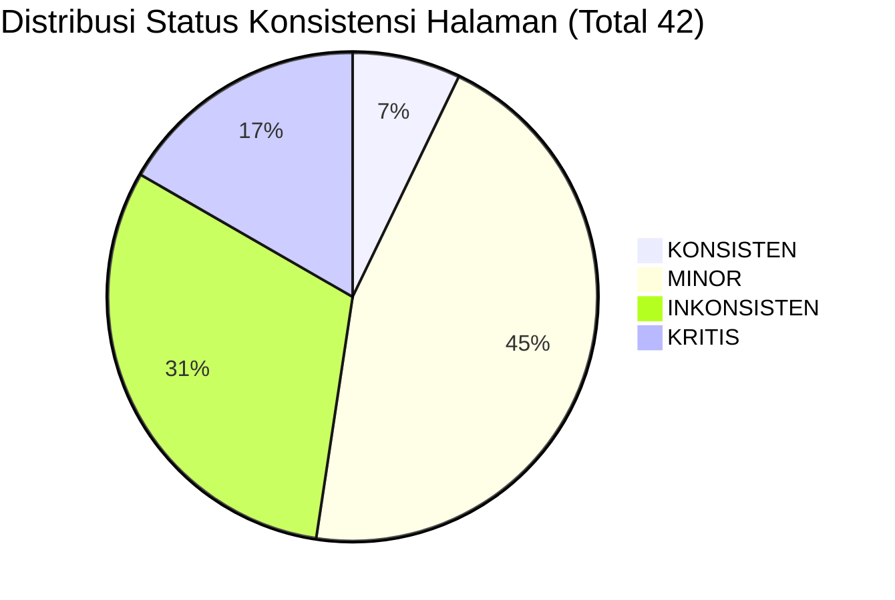

# Audit Konsistensi Layout & Responsivitas UI/UX (Seluruh Codebase)

> **Dokumen Hasil Audit UI/UX Layout Codebase HRIS WIG**  
> *Ruang Lingkup:* Seluruh route `page.tsx`, `layout.tsx`, dan komponen shell pembungkus (kecuali modul GA).  
> *Sifat Dokumen:* Read-Only Audit & Diagnosis (Tanpa perubahan kode / implementasi).  
> *Standar Acuan / Baseline:* Pola **Constrained Centered Container** pada `/employee`.

---

## Bagian 1: Standar Referensi (Baseline: `/employee`)

Halaman utama portal karyawan (`src/app/employee/page.tsx`) dijadikan sebagai tolok ukur standar konsistensi layout untuk audit ini karena merefleksikan filosofi desain aplikasi modern yang terkontrol secara ketat:

1. **Container Pattern**:
   - Menerapkan pola **Constrained Centered Container** (*Mobile-First Canvas / App-in-a-Box*).
   - Seluruh konten diisolasi dalam satu kanvas terpusat menggunakan wrapper:
     ```tsx
     <div className="w-full max-w-md mx-auto space-y-5 pb-24 pt-2 px-3">
     ```
2. **Nilai Max-Width**:
   - Dikunci kaku pada `max-w-md` (**28rem / 448px**).
   - Di monitor ultrawide, desktop 1080p, tablet, maupun layar smartphone, lebar konten tidak pernah melar secara liar dan selalu memiliki lebar identik.
3. **Centering & Horizontal Margins**:
   - Menggunakan `mx-auto` (`margin-left: auto; margin-right: auto;`) sehingga pada layar lebar sisa ruang horizontal didistribusikan secara simetris di sisi kiri dan kanan.
4. **Pendekatan Responsivitas**:
   - Menerapkan *fixed canvas mobile layout* di mana komponen disusun secara vertikal (*single-column flow*) dengan touch target ramah jempol (ukuran tombol `>= 48px`).
5. **Padding & Clearance Global**:
   - Menggunakan `pb-24` (**96px**) pada container utama untuk memberikan jarak aman (*safe clearance*) terhadap **Floating Mobile Bottom Navigation Bar** kaca setinggi ~85px–95px (termasuk tombol absensi kamera melayang `-top-7`).

---

## Bagian 2: Tabel Temuan per Halaman

*Catatan Definisi Status Konsistensi:*
- `KONSISTEN` : Selaras penuh dengan standar referensi `/employee` (terpusat, aman clearance, proporsional).
- `MINOR` : Memiliki perbedaan lebar karena konteks fungsional (misal tabel manajemen HR desktop) namun aman secara fungsional.
- `INKONSISTEN` : Perbedaan drastis dari pola referensi (melar tidak terkontrol, form memanjang 1200px di layar lebar).
- `KRITIS` : Terdapat kerusakan tampilan nyata di mana elemen terbawah (pagination, submit, tombol aksi) **tertutup oleh floating navigation bar** pada layar ponsel.

| No | Route | File Sumber | Container Pattern | Max-Width | Bottom Padding | Responsivitas | Dark Mode | Status Konsistensi |
| :---: | :--- | :--- | :--- | :--- | :--- | :--- | :--- | :---: |
| 1 | `/` (Login) | `src/app/page.tsx` | Constrained Centered Card | `max-w-[420px]` | N/A (Centered) | Mobile-first Flexbox Center | CSS Variables + Hardcoded | **KONSISTEN** |
| 2 | `/scan/[id]` | `src/app/scan/[id]/page.tsx` | Constrained Centered Container | `max-w-sm` / `max-w-lg` | `pb-28` | Mobile-first QR Scanner | CSS Variables | **KONSISTEN** |
| 3 | `/employee` | `src/app/employee/page.tsx` | Constrained Centered Container | `max-w-md (448px)` | `pb-24` | Fixed Mobile Canvas | Sebagian hardcoded (`bg-*-50`) | **KONSISTEN** |
| 4 | `/employee/attendance` | `src/app/employee/attendance/page.tsx` | Fluid via AppShell | `max-w-[1200px]` | `pb-20 lg:pb-0` | Responsive Stack / Camera View | Lengkap (`dark:bg-*-950`) | **INKONSISTEN** |
| 5 | `/employee/attendance-history` | `src/app/employee/attendance-history/page.tsx` | Fluid via AppShell | `max-w-[1200px]` | None (`pb-0`) | Adaptif (Table Desktop, Card Mobile) | Sebagian hardcoded | **KRITIS** |
| 6 | `/employee/attendance/correction` | `src/app/employee/attendance/correction/page.tsx` | Fluid via AppShell | `max-w-[1200px]` | `pb-20 lg:pb-0` | Responsive Card / Form | CSS Variables | **INKONSISTEN** |
| 7 | `/employee/visits` | `src/app/employee/visits/page.tsx` | Fluid via AppShell | `max-w-[1200px]` | `pb-20 lg:pb-0` | Grid (1 col mobile, 3 col desktop) | CSS Variables | **INKONSISTEN** |
| 8 | `/employee/leave` | `src/app/employee/leave/page.tsx` | Fluid via AppShell | `max-w-[1200px]` | None (`pb-0`) | Single-column Card memanjang | CSS Variables | **KRITIS** |
| 9 | `/employee/overtime` | `src/app/employee/overtime/page.tsx` | Fluid via AppShell | `max-w-[1200px]` | `pb-20 lg:pb-0` | Card List + Form Modal | CSS Variables | **INKONSISTEN** |
| 10 | `/employee/payslip` | `src/app/employee/payslip/page.tsx` | Fluid via AppShell | `max-w-[1200px]` | None (`pb-0` / `pb-4`) | Single-column Card memanjang | CSS Variables | **KRITIS** |
| 11 | `/employee/documents` | `src/app/employee/documents/page.tsx` | Fluid via AppShell | `max-w-[1200px]` | `pb-20 lg:pb-0` | Card List Dokumen | CSS Variables | **INKONSISTEN** |
| 12 | `/employee/assets` | `src/app/employee/assets/page.tsx` | Fluid via AppShell | `max-w-[1200px]` | `pb-20 lg:pb-0` | Card List Aset | CSS Variables | **INKONSISTEN** |
| 13 | `/employee/news` | `src/app/employee/news/page.tsx` | Fluid via AppShell | `max-w-[1200px]` | None (`pb-0`) | Card List Berita | CSS Variables | **KRITIS** |
| 14 | `/employee/todos` | `src/app/employee/todos/page.tsx` | Fluid via AppShell | `max-w-[1200px]` | None (`pb-0`) | Card List To-Do | CSS Variables | **KRITIS** |
| 15 | `/employee/profile` | `src/app/employee/profile/page.tsx` | Fluid via AppShell | `max-w-[1200px]` | `pb-20 lg:pb-0` | Multi-card Info Grid | Sebagian hardcoded | **INKONSISTEN** |
| 16 | `/employee/settings` | `src/app/employee/settings/page.tsx` | Fluid via AppShell | `max-w-[1200px]` | `pb-20 lg:pb-0` | Form Card Pengaturan | CSS Variables | **INKONSISTEN** |
| 17 | `/employee/monitoring` | `src/app/employee/monitoring/page.tsx` | Fluid via AppShell | `max-w-[1200px]` | None (`pb-0`) | Table Desktop / Scroll Mobile | CSS Variables | **KRITIS** |
| 18 | `/employee/monitoring/[id]` | `src/app/employee/monitoring/[id]/page.tsx` | Fluid via AppShell | `max-w-[1200px]` | None (`pb-0`) | Detail Card Bawahan | CSS Variables | **KRITIS** |
| 19 | `/dashboard` | `src/app/dashboard/page.tsx` | Desktop Management Shell | `max-w-[1200px]` | None (AppShell standar) | Multi-column Grid (1 col ➔ 4 col) | CSS Variables + Hardcoded badge | **MINOR** |
| 20 | `/dashboard/attendance` | `src/app/dashboard/attendance/page.tsx` | Desktop Management Shell | `max-w-[1200px]` | None (AppShell standar) | Dense Table, horizontal scroll mobile | CSS Variables | **MINOR** |
| 21 | `/dashboard/attendance/correction` | `src/app/dashboard/attendance/correction/page.tsx` | Desktop Management Shell | `max-w-[1200px]` | None (AppShell standar) | Dense Table, horizontal scroll mobile | CSS Variables | **MINOR** |
| 22 | `/dashboard/visits` | `src/app/dashboard/visits/page.tsx` | Desktop Management Shell | `max-w-[1200px]` | None (AppShell standar) | Grid Kartu Kunjungan (1 ➔ 3 col) | CSS Variables | **MINOR** |
| 23 | `/dashboard/leave` | `src/app/dashboard/leave/page.tsx` | Desktop Management Shell | `max-w-[1200px]` | None (AppShell standar) | Dense Table, horizontal scroll mobile | CSS Variables | **MINOR** |
| 24 | `/dashboard/birthdays` | `src/app/dashboard/birthdays/page.tsx` | Desktop Management Shell | `max-w-[1200px]` | `pb-3` (internal) | Table + Timeline List | CSS Variables | **MINOR** |
| 25 | `/dashboard/employees` | `src/app/dashboard/employees/page.tsx` | Desktop Management Shell | `max-w-[1200px]` | None (AppShell standar) | Dense Table, horizontal scroll mobile | CSS Variables | **MINOR** |
| 26 | `/dashboard/employees/create` | `src/app/dashboard/employees/create/page.tsx` | Fluid Unconstrained Form | `max-w-[1200px]` | None (AppShell standar) | Form input meregang penuh 1200px | CSS Variables | **INKONSISTEN** |
| 27 | `/dashboard/employees/[id]/edit` | `src/app/dashboard/employees/[id]/edit/page.tsx` | Fluid Unconstrained Form | `max-w-[1200px]` | None (AppShell standar) | Form input meregang penuh 1200px | CSS Variables | **INKONSISTEN** |
| 28 | `/dashboard/employees/[id]/360-view` | `src/app/dashboard/employees/[id]/360-view/page.tsx` | Desktop Management Shell | `max-w-[1200px]` | None (AppShell standar) | Multi-tab Profil Grid | CSS Variables | **MINOR** |
| 29 | `/dashboard/shifts` | `src/app/dashboard/shifts/page.tsx` | Constrained Inner Card | `max-w-xl (576px)` | None (AppShell standar) | Card List Shift terpusat | CSS Variables | **MINOR** |
| 30 | `/dashboard/master-data` | `src/app/dashboard/master-data/page.tsx` | Desktop Management Shell | `max-w-[1200px]` | None (AppShell standar) | Multi-tab Management Tables | CSS Variables | **MINOR** |
| 31 | `/dashboard/overtime` | `src/app/dashboard/overtime/page.tsx` | Desktop Management Shell | `max-w-[1200px]` | None (AppShell standar) | Dense Table, horizontal scroll mobile | CSS Variables | **MINOR** |
| 32 | `/dashboard/payroll` | `src/app/dashboard/payroll/page.tsx` | Desktop Management Shell | `max-w-[1200px]` | None (AppShell standar) | Dense Table Payroll | CSS Variables | **MINOR** |
| 33 | `/dashboard/master-payroll` | `src/app/dashboard/master-payroll/page.tsx` | Desktop Management Shell | `max-w-[1200px]` | None (AppShell standar) | Dense Table Master Gaji | CSS Variables | **MINOR** |
| 34 | `/dashboard/pph21-calculator` | `src/app/dashboard/pph21-calculator/page.tsx` | Fluid Unconstrained Form | `max-w-[1200px]` | None (AppShell standar) | Kalkulator input meregang 1200px | CSS Variables | **INKONSISTEN** |
| 35 | `/dashboard/bpjs-calculator` | `src/app/dashboard/bpjs-calculator/page.tsx` | Fluid Unconstrained Form | `max-w-[1200px]` | None (AppShell standar) | Kalkulator input meregang 1200px | CSS Variables | **INKONSISTEN** |
| 36 | `/dashboard/overtime-calculator` | `src/app/dashboard/overtime-calculator/page.tsx` | Fluid Unconstrained Form | `max-w-[1200px]` | None (AppShell standar) | Kalkulator input meregang 1200px | CSS Variables | **INKONSISTEN** |
| 37 | `/dashboard/reports` | `src/app/dashboard/reports/page.tsx` | Desktop Management Shell | `max-w-[1200px]` | None (AppShell standar) | Filter Card + Preview Table | CSS Variables | **MINOR** |
| 38 | `/dashboard/audit` | `src/app/dashboard/audit/page.tsx` | Desktop Management Shell | `max-w-[1200px]` | None (AppShell standar) | Dense Table Audit Trail | CSS Variables | **MINOR** |
| 39 | `/dashboard/news` | `src/app/dashboard/news/page.tsx` | Desktop Management Shell | `max-w-[1200px]` | None (AppShell standar) | Card List Berita Perusahaan | CSS Variables | **MINOR** |
| 40 | `/dashboard/letter-requests` | `src/app/dashboard/letter-requests/page.tsx` | Desktop Management Shell | `max-w-[1200px]` | None (AppShell standar) | Dense Table Permohonan Surat | CSS Variables | **MINOR** |
| 41 | `/dashboard/users` | `src/app/dashboard/users/page.tsx` | Desktop Management Shell | `max-w-[1200px]` | None (AppShell standar) | Dense Table User Akun | CSS Variables | **MINOR** |
| 42 | `/dashboard/assets` | `src/app/dashboard/assets/page.tsx` | Desktop Management Shell | `max-w-[1200px]` | None (AppShell standar) | Dense Table Inventaris Aset | CSS Variables | **MINOR** |

---

## Bagian 3: Temuan Detail per Kategori Masalah

### 1. Masalah Container & Max-Width

#### A. Polarisasi Ekstrem antara Beranda Karyawan dan Sub-Halaman Karyawan
- **Deskripsi Masalah**:  
  Halaman beranda `/employee` dikunci ke lebar `max-w-md` (448px), tetapi 15 sub-halaman karyawan lainnya di bawah route `/employee/*` tidak memiliki pembatas lebar internal. Sub-halaman tersebut dibungkus langsung oleh `AppShell` yang memiliki lebar `max-w-[1200px]`. Akibatnya, saat karyawan berpindah dari Beranda ke Cuti atau Slip Gaji di layar laptop/desktop, terjadi lonjakan visual drastis: dari kanvas HP sempit 448px tiba-tiba melar selebar 1200px.
- **Halaman Terdampak**:  
  `/employee/attendance`, `/employee/attendance/correction`, `/employee/attendance-history`, `/employee/leave`, `/employee/overtime`, `/employee/payslip`, `/employee/documents`, `/employee/assets`, `/employee/news`, `/employee/todos`, `/employee/profile`, `/employee/settings`, `/employee/visits`.
- **Snippet Kode Pembanding**:
  - Di Beranda (`src/app/employee/page.tsx` L101):
    ```tsx
    <div className="w-full max-w-md mx-auto space-y-5 pb-24 pt-2 px-3">
    ```
  - Di Halaman Cuti (`src/app/employee/leave/page.tsx` L136):
    ```tsx
    <div className="space-y-6 animate-[fadeIn_0.5s_ease]">
    ```

#### B. Form Input & Kalkulator HR Melar Tanpa Pembatas Ergonomis
- **Deskripsi Masalah**:  
  Pada modul HR Dashboard, halaman kalkulator dan formulir penambahan karyawan tidak menetapkan batas maksimal lebar (`max-w-*`). Elemen input teks, dropdown, dan kartu form meregang penuh hingga `1200px`. Pada monitor resolusi 1920x1080 atau lebih besar, pengguna harus menggerakkan mata dan kursor dari ujung kiri layar ke ujung kanan layar hanya untuk mengisi satu form singkat.
- **Halaman Terdampak**:  
  `/dashboard/employees/create`, `/dashboard/employees/[id]/edit`, `/dashboard/bpjs-calculator`, `/dashboard/pph21-calculator`, `/dashboard/overtime-calculator`.
- **Snippet Kode Ditemukan** (`src/app/dashboard/bpjs-calculator/page.tsx`):
  ```tsx
  <div className="space-y-6 animate-[fadeIn_0.5s_ease]">
      {/* Container form langsung mengisi 1200px lebar AppShell tanpa max-w */}
      <div className="card p-6">
  ```

---

### 2. Masalah Padding & Spacing (Tabrakan Navigasi Bawah / Bottom Nav Collision)

#### A. Cacat Fatal: Elemen Terbawah Tertutup Floating Bottom Nav di Mobile
- **Deskripsi Masalah**:  
  `MobileBottomNav` di `src/app/employee/layout.tsx` adalah komponen melayang (*fixed bottom glassmorphism*) dengan total ketinggian efektif mencapai **85px–95px**. Pembungkus utama di `AppShell.tsx` hanya memberikan kompensasi padding sebesar `pb-16` (**64px**). Terdapat 7 halaman di portal karyawan yang sama sekali tidak menambahkan padding bawah (`pb-0`). Akibatnya, pada perangkat ponsel, elemen kontrol penting di bagian paling bawah layar (seperti tombol pagination *Previous / Next*, tombol submit form, atau baris to-do terakhir) **tertutup secara permanen oleh floating navigation bar dan tidak dapat ditekan oleh pengguna**.
- **Halaman Terdampak (Status KRITIS)**:  
  1. `/employee/attendance-history` (`DataTablePagination` terpotong)
  2. `/employee/leave` (Kontrol pagination riwayat cuti terpotong)
  3. `/employee/payslip` (Kontrol pagination & tombol unduh slip gaji terpotong)
  4. `/employee/news` (Kartu berita paling bawah terpotong)
  5. `/employee/todos` (Form input to-do & item catatan terakhir terpotong)
  6. `/employee/monitoring` (Tabel anggota tim & pagination terpotong)
  7. `/employee/monitoring/[id]` (Detail data terpotong)
- **Snippet Kode Ditemukan**:
  - Di `src/components/layout/AppShell.tsx` L325:
    ```tsx
    <main className={`... ${mobileBottomNav ? "pb-16 lg:pb-0" : ""}`}>
    ```
  - Di `src/app/employee/attendance-history/page.tsx` L220 (tidak ada padding kompensasi):
    ```tsx
    <div className="space-y-6 animate-[fadeIn_0.5s_ease] min-w-0 overflow-hidden">
        {/* Pagination di paling bawah tertimpa navbar */}
        <DataTablePagination ... />
    </div>
    ```

---

### 3. Masalah Responsivitas

#### A. Ketiadaan Transformasi Adaptif (Tabel ke Kartu) pada Dashboard HR
- **Deskripsi Masalah**:  
  Seluruh 24 halaman di HR Dashboard mengandalkan tabel desktop konvensional (`<table className="data-table">`). Saat dibuka di perangkat ponsel pintar atau tablet kecil, seluruh tabel ini dipaksa menggunakan scrolling horizontal (`overflow-x-auto`). Berbeda dengan `/employee/attendance-history` yang memiliki arsitektur responsif matang (`hidden sm:block` untuk tabel desktop dan `sm:hidden` untuk kartu mobile), modul HR tidak memiliki kartu representasi mobile.
- **Halaman Terdampak**:  
  Semua tabel di `/dashboard/attendance`, `/dashboard/leave`, `/dashboard/overtime`, `/dashboard/employees`, `/dashboard/payroll`, `/dashboard/audit`, `/dashboard/letter-requests`, `/dashboard/assets`.
- **Snippet Kode Pembanding yang Baik** (`src/app/employee/attendance-history/page.tsx` L373 & L428):
  ```tsx
  {/* Desktop Table (hidden on mobile) */}
  <div className="hidden sm:block overflow-x-auto">
      <table className="data-table w-full">...</table>
  </div>

  {/* Mobile Card List (visible only on small screens) */}
  <div className="sm:hidden divide-y divide-[var(--border)]">
      {/* Tampilan kartu kompak yang nyaman dibaca di smartphone */}
  </div>
  ```

#### B. Wrapping Tombol Aksi Header pada Layar Sempit (< 380px)
- **Deskripsi Masalah**:  
  Banyak halaman meletakkan tombol aksi utama di sebelah kanan judul header menggunakan `flex items-center justify-between flex-wrap gap-3`. Pada ponsel dengan layar sempit (seperti resolusi 360px atau 375px), tombol aksi terdorong ke bawah (*wrapped*) dan posisinya bertabrakan dengan deskripsi subtitle.
- **Halaman Terdampak**:  
  `/employee/leave`, `/employee/overtime`, `/employee/visits`, `/dashboard/leave`, `/dashboard/overtime`.

---

### 4. Masalah Dark Mode

#### A. Hardcoded Tailwind Pastel Colors Tanpa Pasangan Varian Dark
- **Deskripsi Masalah**:  
  Meskipun arsitektur CSS global di [src/app/globals.css](file:///c:/Users/ITSupportWIG/Desktop/hriswig/src/app/globals.css) telah memiliki token lengkap (`--background`, `--card`, `--border`, `--text-primary`), beberapa komponen halaman masih menggunakan class warna Tailwind terang secara statis (seperti `bg-rose-50 text-rose-600`, `bg-amber-50`, `bg-sky-50`, `bg-emerald-50`). Ketika pengguna mengaktifkan mode gelap (*Dark Mode*), kotak-kotak elemen ini tetap berwarna pastel putih terang yang menghasilkan silau berlebih (*blinding stark contrast*) terhadap latar belakang gelap `#15151C`.
- **Halaman Terdampak**:  
  - `/employee` (Grid Quick Actions 8 ikon)
  - `/employee/profile` (Statistik saldo cuti)
  - `/dashboard` (Statistik card badges)
- **Snippet Kode Ditemukan** (`src/app/employee/page.tsx` L158):
  ```tsx
  { href: "/employee/leave", icon: CalendarOff, label: "Cuti", bg: "bg-rose-50", color: "text-rose-600" }
  // Tidak ada varian dark:bg-rose-950/30 dark:text-rose-400
  ```

---

### 5. Masalah Komponen Data (Inkonsistensi Tabel vs Kartu)

- **Deskripsi Masalah**:  
  Di dalam portal karyawan `/employee`, terdapat ketidakkonsistenan tipe data yang sama namun disajikan dengan pendekatan yang saling bertolak belakang:
  1. **Riwayat Absensi**: Disajikan dalam format adaptif (Tabel lengkap di Desktop, Kartu 3-kolom di Mobile).
  2. **Riwayat Cuti & Riwayat Lembur**: Disajikan murni dalam bentuk Kartu Memanjang di semua breakpoint. Di monitor PC 24 inch, satu kartu cuti meregang sepanjang 1200px dengan banyak ruang kosong tak terpakai.
  3. **Riwayat Slip Gaji**: Disajikan dalam bentuk kartu ringkas satu baris dengan tombol aksi di pojok kanan.
  4. **Kunjungan Lapangan**: Disajikan dalam bentuk kartu bergrid (`grid-cols-1 md:grid-cols-2 xl:grid-cols-3`).
- **Dampak UX**:  
  Pengalaman pengguna menjadi tidak kohesif; pengguna merasakan modul dibangun oleh pengembang yang berbeda tanpa design guideline data-display yang disepakati.

---

### 6. Masalah Lain yang Ditemukan saat Crawling

1. **Struktur Pembungkus Ganda (*Redundant Nesting*)**:
   - `AppShell.tsx` telah membungkus seluruh children dalam `<div className="p-4 md:p-6 lg:p-8 max-w-[1200px] mx-auto">`.
   - Namun beberapa halaman menambahkan inner padding vertikal lagi seperti `py-20` atau `md:py-8` (`src/app/dashboard/employees/[id]/360-view/page.tsx` L71), yang menyebabkan jarak kosong vertikal di atas halaman menjadi sangat berlebihan di layar monitor.
2. **Ketergantungan terhadap Kondisi Layar Penuh pada Scan QR**:
   - Route `/scan/[id]` berdiri independen tanpa `AppShell` (karena dibuka via pemindaian kamera umum). Halaman ini sudah memiliki pembatas terpusat `max-w-sm` / `max-w-lg` dengan `pb-28`, sehingga dinilai selaras secara kontekstual (*intentional exception*).

---

## Bagian 4: Ringkasan Scope Refactor

### Total Halaman Diaudit: **42 Halaman** (+ 4 Layout & Shell)
*(Terdiri dari 24 Halaman HR Dashboard, 16 Halaman Portal Karyawan, 1 Halaman Login Root, dan 1 Halaman Pemindai QR Scan)*.

---

### Distribusi Status Konsistensi:



- **KONSISTEN**: **3 Halaman (7.1%)**  
  - `/ (login)`
  - `/scan/[id]`
  - `/employee` (Baseline acuan)
- **MINOR**: **19 Halaman (45.2%)**  
  - Seluruh halaman tabel/manajemen utama HR Dashboard (konteks admin desktop terjustifikasi).
- **INKONSISTEN**: **13 Halaman (31.0%)**  
  - 8 Halaman di `/employee/*` yang melar ke 1200px tidak selaras dengan beranda.
  - 5 Halaman form/kalkulator di `/dashboard/*` yang meregang penuh tanpa pembatas ergonomis.
- **KRITIS**: **7 Halaman (16.7%)**  
  - 7 Halaman portal karyawan di mana konten bawah / pagination tertutup oleh floating navbar di smartphone.

---

### Komponen & File Paling Berdampak (Strategis):

1. **`src/components/layout/AppShell.tsx` (Tingkat Dampak: TERTINGGI / KRITIS)**  
   - Merupakan pembungkus tunggal (*single point of truth*) untuk seluruh halaman HR Dashboard dan Employee Portal.
   - Mengubah kompensasi `pb-16` menjadi jarak aman yang dinamis/cukup (misal `pb-28 lg:pb-8`) pada `AppShell` akan **secara instan menyembuhkan seluruh 7 halaman berstatus KRITIS** tanpa perlu menyentuh satu pun dari 7 file halaman tersebut.
2. **`src/app/employee/layout.tsx` (Tingkat Dampak: TINGGI)**  
   - Mengontrol konfigurasi navigasi bawah (*MobileBottomNav*) dan breakpoint penyembunyian bottom bar.
3. **`src/app/globals.css` (Tingkat Dampak: MENENGAH)**  
   - Pusat styling utilitas (`.card`, `.btn`, `.form-input`, `.data-table`). Standardisasi varian tema dan pembungkus form dapat dikendalikan dari file ini.

---

### Estimasi Luas Refactor:

Berdasarkan audit komprehensif ini:
- **70% Perbaikan Masalah Kritis & Tata Letak dapat diselesaikan di Level Shell/Layout** (`AppShell.tsx` dan `employee/layout.tsx`). Dengan perbaikan terpusat pada 2 file ini, tabrakan floating navbar pada seluruh halaman karyawan dan konsistensi padding global langsung teratasi secara menyeluruh.
- **30% Sisanya merupakan Refactor Tingkat Halaman (Per-Page)**: Terutama penambahan pembatas lebar form ergonomis pada 5 halaman kalkulator/form HR, serta penyelarasan varian Dark Mode pada grid ikon beranda karyawan.
